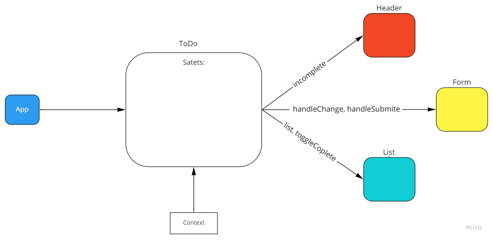

# To Do List Manager

## About

This application was made to solve busy people time management complexities (obviously lies!).

### Author : Hatem Husnieh

## install

1. copy the link of the repo
1. clone the repo on your local machine by `git clone repo-url`
1. download independencies by `npm i`
1. run the app

---

## Phase 1 Version 1.0.0

## Deploy, Run and Test

- [Pull Request](https://github.com/Hatemhusnieh/todo-app/pull/4)
- [Production](https://to-do-hatem.netlify.app/)

### Setup

#### Running the app

- `npm start`

### UML:

---

## Phase 2 Version 1.2.0

## Deploy, Run and Test

- [Pull Request](https://github.com/Hatemhusnieh/todo-app/pull/5)
- [Production](https://to-do-hatem.netlify.app/)

### Setup

#### Running the app

- `npm start`

### UML:

---
